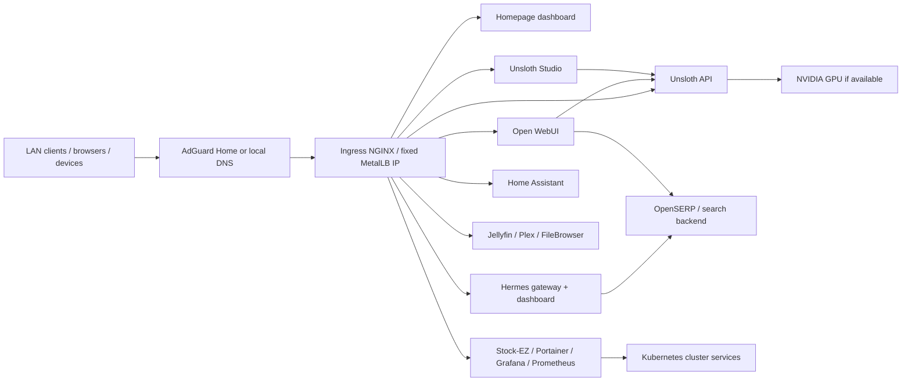

# Homelab Kubernetes Stack

This repository provisions a Kubernetes-based homelab for AI, automation, media, and monitoring workloads on a LAN. The stack is intentionally opinionated: a single ingress entry-point, a DNS-friendly hostname layer, and a set of services that work together without requiring a full cloud backend.

## Architecture overview



## Included services

- Stock-EZ for app workloads and internal reporting
- Unsloth API and Studio as the primary local AI stack
- Open WebUI for browser-based chat and model access
- OpenSERP as the local search backend used by Hermes and related AI tooling
- Hermes as a standalone agent gateway and dashboard
- Homepage dashboard for service discovery and quick access
- Prometheus and Grafana for metrics, health, and dashboards
- Portainer for cluster and container management
- Home Assistant for smart-home automation and local control
- Jellyfin, Plex, and File Browser for media access
- qBittorrent for LAN downloads
- Netdata and GPU telemetry where available

## Key design principles

1. Use a single ingress entrypoint for LAN hostnames.
2. Prefer LAN DNS (for example AdGuard Home) over ad hoc /etc/hosts overrides.
3. Keep inter-service communication inside the Kubernetes cluster via service DNS names.
4. Pin the MetalLB ingress IP so the entrypoint stays stable across restarts and reboots.
5. Keep public-facing URLs stable and intentionally namespaced under `.homelab.home.arpa`.
6. Treat DNS and ingress as a first-class part of the stack; 404s are often a routing or hostname issue rather than an app issue.

## Network and DNS model

The stack is intended to be reachable through hostnames such as:

- `dashboard.homelab.home.arpa`
- `unsloth.homelab.home.arpa`
- `unsloth-studio.homelab.home.arpa`
- `open-webui.homelab.home.arpa`
- `openserp.homelab.home.arpa`
- `hermes.homelab.home.arpa`
- `hermes-dashboard.homelab.home.arpa`
- `homeassistant.homelab.home.arpa`
- `media.homelab.home.arpa`
- `plex.homelab.home.arpa`

### Preferred setup

Use a DNS server on the LAN, ideally AdGuard Home, as the authoritative source for those hostnames. Put the ingress IP there rather than a node IP or stale value.

The active ingress is pinned to `192.168.0.6` in this repo and should remain stable across restarts.

Example:

```text
dashboard.homelab.home.arpa      -> 192.168.0.6
unsloth.homelab.home.arpa        -> 192.168.0.6
unsloth-studio.homelab.home.arpa -> 192.168.0.6
open-webui.homelab.home.arpa     -> 192.168.0.6
openserp.homelab.home.arpa       -> 192.168.0.6
hermes.homelab.home.arpa         -> 192.168.0.6
```

### Fallback setup

If there is no LAN DNS server, use a host override on the client. This is fine for a lab but should not be treated as the network-wide solution.

```bash
sudo sh -c 'echo "192.168.0.6 dashboard.homelab.home.arpa unsloth.homelab.home.arpa unsloth-studio.homelab.home.arpa open-webui.homelab.home.arpa openserp.homelab.home.arpa hermes.homelab.home.arpa hermes-dashboard.homelab.home.arpa homeassistant.homelab.home.arpa media.homelab.home.arpa plex.homelab.home.arpa" >> /etc/hosts'
```

The helper script in this repo can generate a host-file style entry. It prefers the ingress IP when it can detect one, and falls back to the node IP only when needed.

```bash
sudo ./scripts/update-hosts.sh
```

### NixOS-specific instructions

On NixOS, prefer `networking.extraHosts` or your own Nix-managed DNS config instead of editing `/etc/hosts` directly.

```nix
networking.extraHosts = ''
  192.168.0.6 dashboard.homelab.home.arpa unsloth.homelab.home.arpa unsloth-studio.homelab.home.arpa open-webui.homelab.home.arpa openserp.homelab.home.arpa hermes.homelab.home.arpa hermes-dashboard.homelab.home.arpa homeassistant.homelab.home.arpa media.homelab.home.arpa plex.homelab.home.arpa
'';
```

Then rebuild:

```bash
sudo nixos-rebuild switch
```

## Recommended LAN networking

This is the pickup from the most recent troubleshooting cycle:

- keep the router DHCP/LAN range and MetalLB pool aligned
- pin the MetalLB pool to a static ingress IP in the active LAN subnet, for example `192.168.0.6-192.168.0.6`
- use AdGuard Home or another LAN DNS server as the canonical resolver for `*.homelab.home.arpa`
- avoid mixing IP families (for example, `192.168.0.x` and `192.168.1.x`) in the same DNS setup
- do not assume the K3s node IP is the ingress IP unless the cluster has no external IP assigned

### MetalLB setup

```bash
METALLB_IP_POOL=192.168.0.6-192.168.0.6 ./scripts/install-metallb.sh
```

This is the active repo default and keeps the ingress IP stable across cluster restarts.

## Prerequisites

Before running the stack, verify the following:

- a working `k3s` or Kubernetes cluster is running
- `kubectl` is configured and points at the correct cluster
- ingress-nginx is installed
- MetalLB is configured if you want an ingress IP on the LAN
- your router or DNS appliance is not serving stale host records for the `homelab.home.arpa` zone
- the LAN nodes can reach the cluster node and ingress IPs

## Quick start

1. Review and adjust `.env` or `.env.example`.
2. Install ingress-nginx if it is not already present:

```bash
./scripts/install-ingress-nginx.sh
```

3. Install or update MetalLB to match your LAN subnet:

```bash
METALLB_IP_POOL=192.168.0.2-192.168.0.253 ./scripts/install-metallb.sh
```

4. Deploy the stack:

```bash
chmod +x scripts/*.sh
./scripts/deploy.sh
```

5. Validate the resources:

```bash
kubectl get pods -n homelab
kubectl get svc -n homelab
kubectl get ingress -n homelab
```

## Service URLs and ports

| Service | URL | Notes |
| --- | --- | --- |
| Homepage dashboard | `http://dashboard.homelab.home.arpa` | ingress-backed UI |
| Project README | `https://github.com/SushritPasupuleti/homelab/blob/main/README.md` | repo documentation |
| Unsloth API | `http://unsloth.homelab.home.arpa` | primary OpenAI-compatible model API |
| Unsloth Studio | `http://unsloth-studio.homelab.home.arpa` | local web interface for the Unsloth stack |
| Open WebUI | `http://open-webui.homelab.home.arpa` | chat UI and model management |
| OpenSERP | `http://openserp.homelab.home.arpa` | search backend |
| Hermes | `http://hermes.homelab.home.arpa` | gateway endpoint |
| Hermes dashboard | `http://hermes-dashboard.homelab.home.arpa` | dashboard UI |
| Portainer | `http://portainer.homelab.home.arpa` | container admin |
| Home Assistant | `http://homeassistant.homelab.home.arpa` | smart-home automation |
| Grafana | `http://grafana.homelab.home.arpa` | metrics visualisation |
| Prometheus | `http://prometheus.homelab.home.arpa` | metrics collection |
| qBittorrent | `http://torrent.homelab.home.arpa` | downloads |
| File Browser | `http://files.homelab.home.arpa` | files |
| Jellyfin | `http://media.homelab.home.arpa` | media streaming |
| Plex | `http://plex.homelab.home.arpa` | media streaming |

### NodePort fallback

If ingress is not available or a host entry is missing, use the node IP and service ports as a fallback. For example:

```bash
curl -I http://<node-ip>:30080
curl -I http://<node-ip>:30900
```

## Troubleshooting guide

### 1. Hostname resolves but returns 404

This is usually a DNS or ingress mismatch.

Check:

```bash
nslookup dashboard.homelab.home.arpa
curl -I http://dashboard.homelab.home.arpa
kubectl get ingress -n homelab -o wide
kubectl describe ingress homelab-ingress -n homelab
```

If the host resolves to a stale IP, fix the LAN DNS record or local host entry.

### 2. The hostname resolves to the wrong subnet

Check whether the hostname points to an old `192.168.1.x` address while the router is on `192.168.0.x`.

This is a common problem when DHCP, MetalLB, and AdGuard are changed independently.

### 3. Services do not respond on their hostnames

Test the backend service directly:

```bash
kubectl get svc -n homelab
kubectl get endpoints -n homelab
kubectl get pods -n homelab
```

Then test the service from inside the cluster:

```bash
kubectl run curl-debug --rm -it --restart=Never --image=curlimages/curl -- sh
```

Inside the pod:

```bash
curl -I http://homelab-dashboard.homelab.svc.cluster.local
curl -I http://hermes.homelab.svc.cluster.local:9119
curl -I http://openserp.homelab.svc.cluster.local:7000
```

### 4. Hermes is up but dashboard/auth gates are redirecting or rejecting requests

This is expected behavior for the Hermes dashboard when it is protected by basic auth or access controls. Validate the API and dashboard ports and ensure the service is reachable through ingress.

The Hermes service is configured to run both the gateway and the dashboard in the same pod.

### 5. Open WebUI, Hermes, or OpenSERP do not connect to Ollama

Verify the internal service DNS and the model endpoint:

```bash
kubectl get svc -n homelab ollama
kubectl get pods -n homelab | grep ollama
curl -I http://ollama.homelab.svc.cluster.local:11434
```

Also check the relevant config files and env values to ensure they reference the cluster-local service names rather than a LAN IP.

## Best practices

- Keep `.env` and `.env.example` aligned with the actual deployment targets.
- Prefer ingress hostnames over raw node IPs for all user-facing services.
- Keep a single source of truth for the router/LAN subnet and MetalLB pool.
- Do not leave stale `192.168.1.x` host entries in DNS while the router is on `192.168.0.x`.
- Treat AdGuard as the network-wide DNS authority; use `/etc/hosts` only for debugging or single-client overrides.
- Verify ingress, MetalLB, and DNS in the same pass whenever a LAN change happens.
- Keep service-to-service communication inside the cluster; do not hardcode external IPs into config when a service name will do.
- Check the ingress first when a hostname returns a 404; often the app is healthy and the route is wrong.

## Useful admin commands

```bash
kubectl get pods -n homelab
kubectl get svc -n homelab
kubectl get ingress -n homelab
kubectl describe ingress homelab-ingress -n homelab
kubectl logs -n homelab -l app=hermes --tail=200
kubectl logs -n homelab -l app=ollama --tail=200
kubectl get nodes -o wide
```

## Directory map

- `k8s/` – Kubernetes manifests
- `scripts/` – deploy, update, and DNS helper scripts
- `docs/` – troubleshooting and operational notes
- `.env` – local runtime values for the current machine
- `.env.example` – safe template for new deployments

## NVIDIA GPU troubleshooting

See [docs/nvidia-gpu-troubleshooting.md](docs/nvidia-gpu-troubleshooting.md) for host-side GPU runtime setup and Kubernetes readiness checks.

## AdGuard helper

Use the helper script to generate DNS rewrite entries for the active homelab hostnames.

```bash
./scripts/adguard-hosts.sh
```

This script prioritises the detected ingress IP and falls back to the node IP. It is meant to help you keep AdGuard aligned with the actual cluster topology instead of stale LAN assumptions.

## Deploy and update workflow

### Deploy

```bash
./scripts/deploy.sh
```

### Update

```bash
./scripts/update.sh
```

### Delete a local stack

```bash
./scripts/delete-homelab.sh
```

## Notes

- The repo is deliberately designed around a real local network environment, not a cloud host.
- The prompt-driven issue resolution path here was focused on DNS correctness, ingress routing, and service health rather than changing the app logic itself.
- A 404 on a hostname after successful DNS resolution is often an ingress canonicalization problem, not an application crash.

The deploy script now auto-detects whether the host has an NVIDIA GPU. If it does, it enables GPU-aware Ollama settings automatically:

- toggles `OLLAMA_USE_NVIDIA=true` when `nvidia-smi` or `/dev/nvidia*` is present
- sets `NVIDIA_VISIBLE_DEVICES=all` and `NVIDIA_DRIVER_CAPABILITIES=compute,utility`
- adds the `nvidia` `RuntimeClass` and GPU resource requests for the Ollama pod
- leaves the deployment CPU-only when no GPU is detected

If you want to force the setting on a GPU box, set the environment value before running the script:

```bash
OLLAMA_USE_NVIDIA=true ./scripts/deploy.sh
```

To configure the host-side runtime, run the helper script:

```bash
./scripts/setup-nvidia.sh
```

On NixOS, the helper prints the hardware and containerd configuration you should add to your system config. Use this exact block:

```nix
hardware.nvidia = {
  modesetting.enable = true;
  powerManagement.enable = false;
  powerManagement.finegrained = false;
  open = false;
};

hardware.opengl.enable = true;
hardware.nvidia-container-toolkit.enable = true;
virtualisation.containerd.enable = true;
```

Then rebuild:

```bash
sudo nixos-rebuild switch
```

And install the Kubernetes device plugin:

```bash
kubectl apply -f https://raw.githubusercontent.com/NVIDIA/k8s-device-plugin/v0.14.2/nvidia-device-plugin.yml
```

For the full host-side troubleshooting notes, including the exact `nvidia-ctk`/containerd fixes and the symptoms seen on this NixOS setup, see [docs/nvidia-gpu-troubleshooting.md](docs/nvidia-gpu-troubleshooting.md).

## Recommended prerequisites

- Kubernetes cluster with storage class available (`longhorn`, `openebs`, or local-path)
- Ingress controller (for example `ingress-nginx` or Traefik)
- NVIDIA container runtime configured on the worker node if GPU acceleration is required
- LAN DNS entries or `/etc/hosts` overrides
- Adequate CPU/RAM for Ollama models, especially for large LLMs

## WDEX4100 media shares for Kodi, VLC, DLNA, and Plex

The WD EX4100 is a good fit as a read-only media source on the LAN. The most reliable pattern is:

1. Mount the WDEX4100 share to a stable host path such as `/mnt/wdex4100/media`.
2. Expose the share through a media server for browsing and metadata.
3. Keep a DLNA server available for Kodi/VLC/other DLNA clients.
4. Optionally run Plex for a more polished UI if you prefer a paid, feature-rich media experience.

Recommended setup:

- Jellyfin at `http://media.homelab.home.arpa` for a free media library UI
- MiniDLNA at the LAN for Kodi/VLC/DLNA autodiscovery
- Plex at `http://plex.homelab.home.arpa` for Plex clients if you want that experience

Mount the WDEX4100 share on the Kubernetes node:

```bash
sudo mkdir -p /mnt/wdex4100/media
sudo mount -t cifs //192.168.1.11/Volume_1/Media /mnt/wdex4100/media \
  -o username=admin,password=YOUR_PASSWORD,vers=3.0,uid=$(id -u),gid=$(id -g),iocharset=utf8
```

Or use the helper script:

```bash
PASSWORD='YOUR_PASSWORD' ./scripts/mount-wdex4100.sh
```

After the mount exists, deploy the media stack:

```bash
./scripts/deploy.sh
```

The manifests in `k8s/media/` assume the media root is available at `/mnt/wdex4100/media` and map it into the service containers from the WDEX4100 at `192.168.1.11`.

## Dashboard replacement

The original static HTML dashboard was intentionally replaced with Homepage, which is much easier to configure and extend without editing frontend code. You can update the dashboard directly in `k8s/dashboard/dashboard.yaml` by editing the `settings.yaml`, `services.yaml`, and `widgets.yaml` blocks.

The resulting dashboard is mobile friendly and supports quick links, service tiles, and widgets for a more complete homelab overview.

## Bambu A1 central management

There is no full browser-hosted clone of Bambu Studio itself, but there are two practical paths:

- Official path: Bambu Farm Manager + Bambu Handy (from Bambu Lab ecosystem)
- Self-hosted path: Home Assistant on your homelab with a Bambu integration for centralized monitoring/control in a mobile-friendly UI

This stack now includes Home Assistant so you can use the self-hosted path on your LAN.

## Notes

- Stock-EZ is not a public SaaS product; it is meant to run in a private homelab environment.
- The Homepage dashboard and Home Assistant UI are mobile friendly and configurable.
- This repository is intentionally generic so it can be adapted to your cluster, networking, and storage setup.

## Security note

These manifests are intended for internal networks only. Add authentication or VPN access before exposing services beyond your LAN.
